# 맞고 시각 방향 — 세 가지 제안

2026-09-29 · 디자인 리드 · **사용자 선택 대기 / 앱 미적용** · 기준 `39e8af9`.

추천은 **A. 사이 · 맞고**다. 고전 카드의 흰 면·적색을 살리는 먹빛 판, 한지색 행동 버튼, 정돈된 한국어와 숫자로 ‘마주 앉은 두 사람’이라는 제품 성격을 만든다. 프레임워크 교체 없이 화면 전체의 밀도·위계를 바꾸고, 사건 순간에는 짧고 분명한 손맛을 준다.

근거는 [조사 문서](../research/visual-direction.md). 관련 요구사항: `spec.md` UX §6·NF-01~04/07/08·AC-06/07, `plan.md` §1.6/1.8·D2, `ui-spec.md` UX-01~25, [Galaxy 계획 .1-A/.3-A/.3-D](../plan-galaxy-solo.md). 본 문서는 게임 규칙을 변경하지 않는다.

## 1. 선택 요약

| 방향 | A · 사이 — 먹빛과 한지색 **추천** | B · 밤의 맞고 — 프리미엄 테이블 | C · 맞고 클럽 — 팝 아케이드 |
|---|---|---|---|
| 한 문장 | 조용한 판에 선명한 손맛 | 둘만의 라운지에서 즐기는 한 판 | 짧고 가볍게, 밝은 에너지 |
| 시각 주제 | 전통 소재의 색과 여백, 원과 얇은 선 | 짙은 자주빛·샴페인 포인트·아치 | 잉크 블루·라임·큰 무게의 글자·스티커 |
| 폰트 | Pretendard Variable 1종 | SUIT Variable 1종 | Wanted Sans Variable 1종 |
| 판 외곽 | 12px 반경, 평평한 면 | 50px 아치 모서리, 테이블 프레임 | 24px 반경, 채도가 있는 평면 |
| 숫자 강조 | 점수에만 밝은 한지색 | 고정 HUD 박스·얇은 테두리 | 둥근 블록과 강한 굵기 |
| 사건 | 도장처럼 한 번 찍고 사라짐 | 동심원 한 번, 금속 광택 없이 | 글자 소폭 회전+짧은 선 2~6개 |
| 장점 | 카드와 문화적 어울림, 장시간 읽기, 구현 비용 낮음 | 금액/정산의 특별함, 다크 브랜드 일관성 | 작은 화면에서 명료, 즉시 느끼는 변화 |
| 주의점 | 지나치게 조용해지지 않도록 사건의 크기·소리 확보 | 실사 카지노/과금 게임처럼 보이지 않게 장식 절제 | 라임 면적과 사건 강도를 제한해 피로 억제 |
| 앱 신규 의존성 | 없음 | 없음 | 없음 |
| 폰트 실측 추가량 | 142.8 KiB | 148.5 KiB | 107.8 KiB |
| 계획 최대 추가량 | **244 KiB** 공통 상한. 현 체크아웃 실측1,010.2→≤1,254.2 KiB | 같은 상한 | 같은 상한, 폰트 차이만큼 추가 여유 |

C의 ‘밝음’은 전체 배경을 흰색으로 만드는 뜻이 아니다. `intend.md` §4.4·NF-04의 다크 판은 세 안 모두 지킨다. B/C의 판 색과 A의 폰트 변경은 **UX-11/13 개정 후보**이며 이번 PR이 기존 구현 규범을 자동으로 바꾸지는 않는다.

## 2. 412×915 목업

모두 [정적 HTML](mockups/prototype.html)을 **Playwright Chromium, CSS viewport 412×915, deviceScaleFactor 3.5, screenshot scale `css`**로 렌더했다. 결과 PNG는 정확히 412×915이며 각 300,000B 이하를 검사한다. WebKit에서도 동일 18개 상태를 렌더 검증한다. PNG가 물리 1442×3203 캡처라는 뜻은 아니다. 이미지 생성 모델·그림 편집으로 화면을 만들지 않았다.

각 안 **6장**: 홈, 인게임+대상 선택, 고/스톱, 뻑, 쪽, 정산. 카드 ``는 `packages/web/public/cards/*.svg`를 직접 참조하며 원본·도상·비율을 변경하지 않았다. 손패 카드 56×91, 노출 히트 박스 폭≥48, 5장×2행. 카드 자체의 회전은 홈의 장식 배치에서만 사용한다.

**사용자 추가 피드백 반영(2026-09-29): 먹을 패 선택창에는 반드시 실제 카드 이미지를 함께 표시한다.** 세 안 모두 바닥의 후보 2장을 선택 버튼에 44×72px로 반복하고, 월·종류·‘이 패 먹기’를 병기한다. 두 버튼은 같은 강조 수준이며 이미지는 장식 썸네일이 아니라 선택할 카드 ID와 1:1 연결한다. 예시의 4월 초단/피가 같은 원본 SVG인지 렌더 검사도 추가했다. 이미지가 들어가는 대상 선택 행은 158px, 고/스톱·사건 행은118px를 사용하고 손패는 고정한다.

| 화면 | A · 사이 | B · 밤의 맞고 | C · 맞고 클럽 |
|---|---|---|---|
| 홈 | [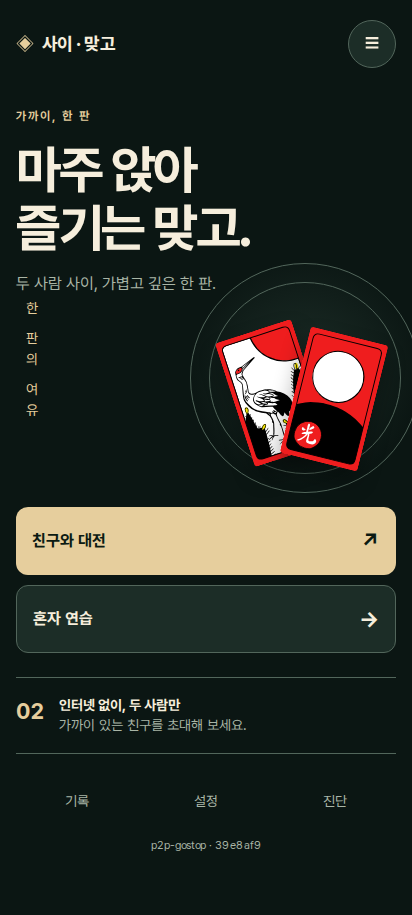](mockups/ink-home.png) | [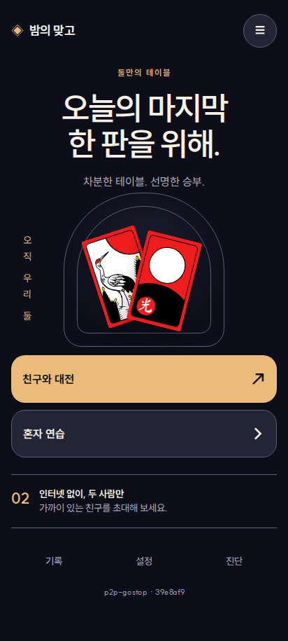](mockups/club-home.png) | [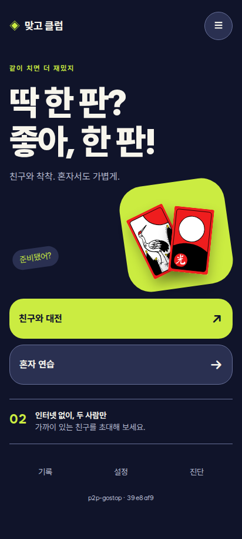](mockups/pop-home.png) |
| 인게임·선택 | [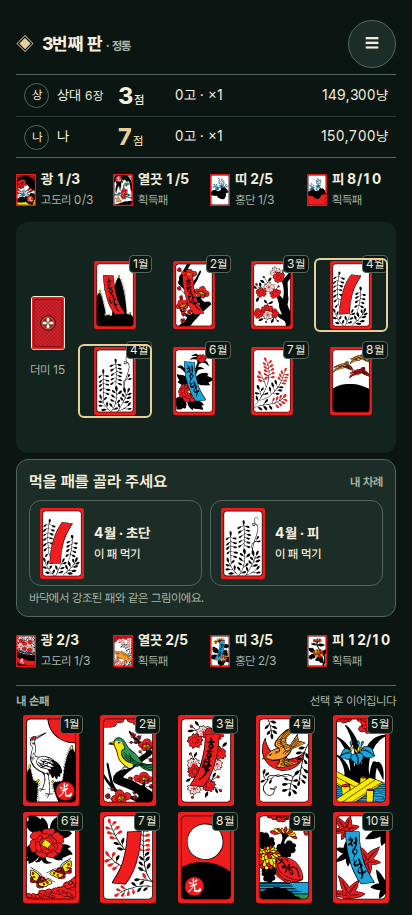](mockups/ink-game.png) | [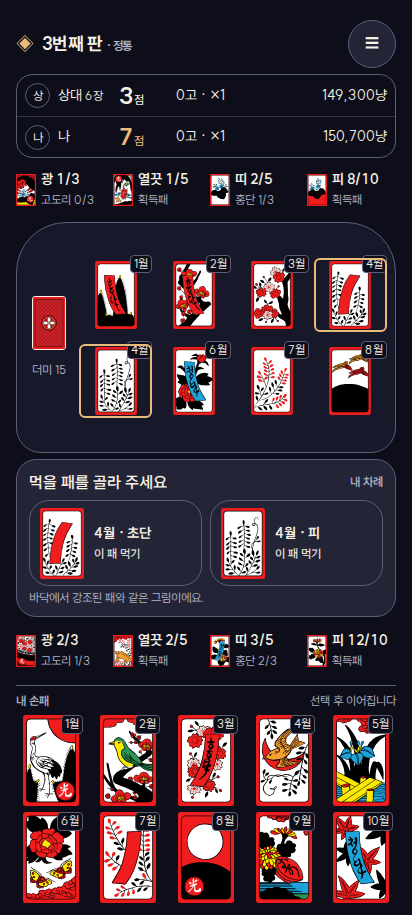](mockups/club-game.png) | [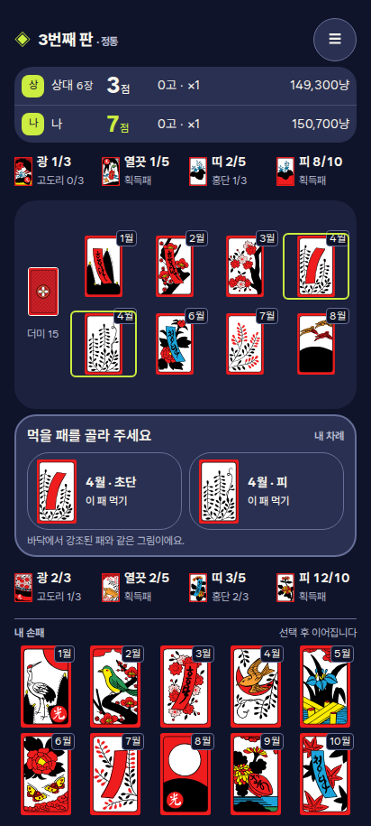](mockups/pop-game.png) |
| 고/스톱 | [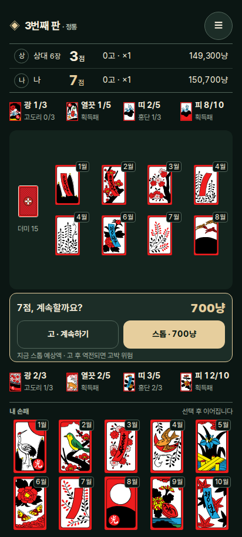](mockups/ink-gostop.png) |  | [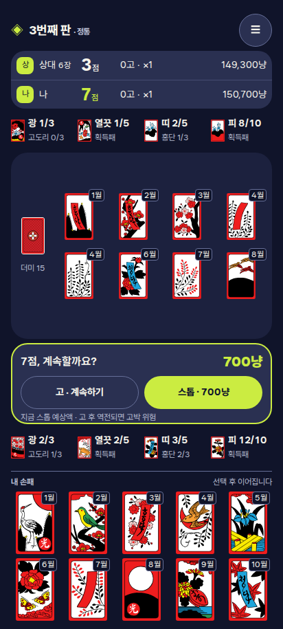](mockups/pop-gostop.png) |
| 뻑 | [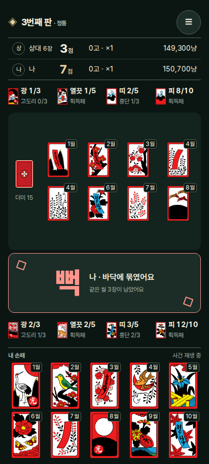](mockups/ink-ppeok.png) | [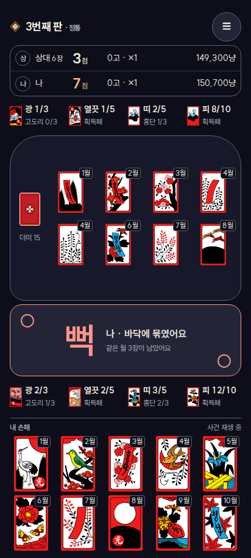](mockups/club-ppeok.png) | [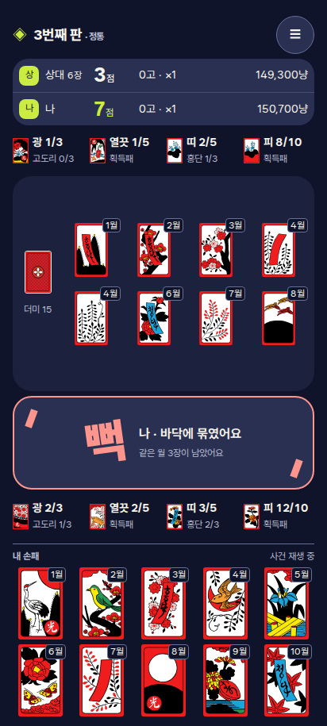](mockups/pop-ppeok.png) |
| 쪽 | [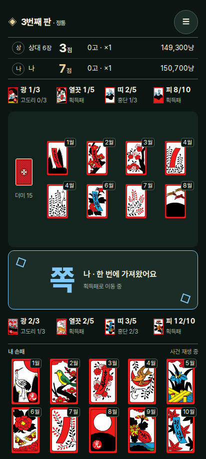](mockups/ink-jjok.png) | [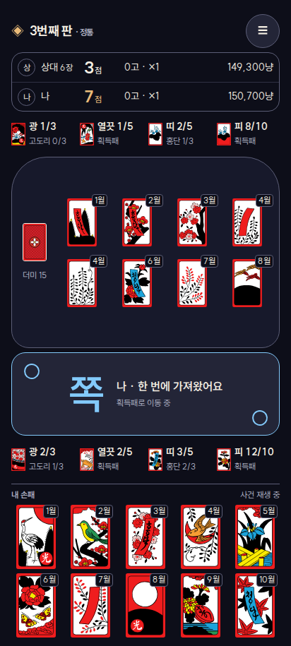](mockups/club-jjok.png) | [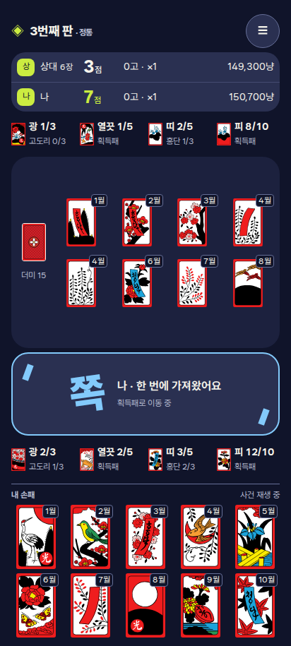](mockups/pop-jjok.png) |
| 정산 | [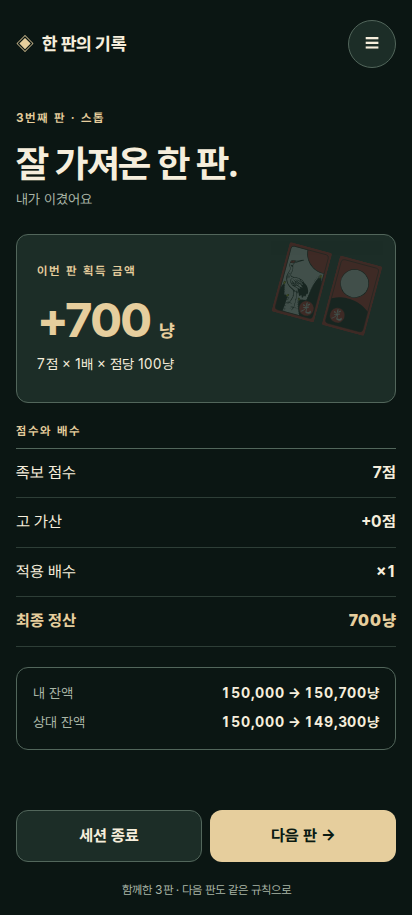](mockups/ink-settlement.png) | [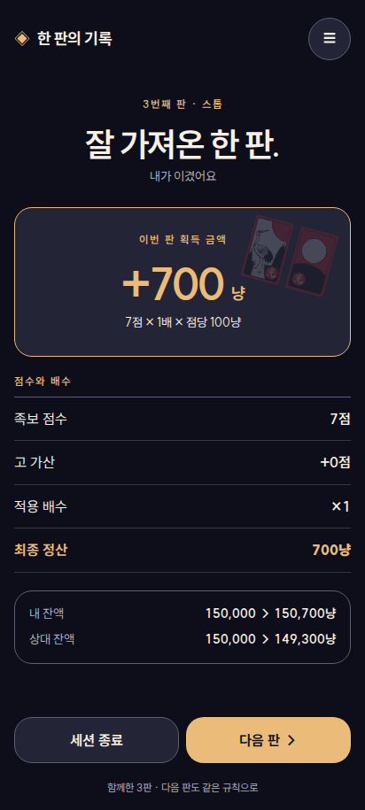](mockups/club-settlement.png) | [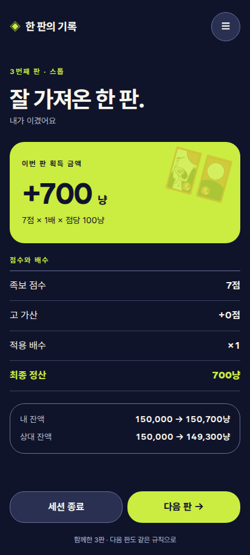](mockups/pop-settlement.png) |

**목업 범위:** 화면들은 독립적인 시각 표본이다. 카드·획득패 썸네일·7점·금액은 위계를 보여 주는 예시이며 하나의 합법 게임 상태/연속 리플레이를 재현한 것이 아니다. 정산 예시는 7×1×100=700만 보여 주며 실제 족보 분해는 엔진 정산 객체를 그대로 소비한다. 정적 버튼은 동작하지 않는다. 현재 손패 태그·획득 그룹의 최종 의미, FR-40~48의 세부 보조 정보는 HUD 담당의 확정 계약으로 구현한다. 새 앱 이름도 임시 무드 카피다.

## 3. 색·서체·형태 계약 (VD-01/04)

표의 값은 `oklch(L C H)`다. 코드와 표 모두 동일한 역할 토큰으로 이식하며 브랜드 색을 사건 의미 색에 덮어쓰지 않는다.

| 역할 | A | B | C |
|---|---|---|---|
| bg | `19% .018 170` | `17% .022 280` | `20% .045 275` |
| table | `24% .025 170` | `22% .035 280` | `26% .055 275` |
| surface | `28% .025 170` | `27% .035 280` | `32% .06 275` |
| on-surface | `95% .025 85` | `96% .018 85` | `97% .012 100` |
| muted | `76% .025 140` | `77% .026 280` | `80% .03 275` |
| primary / focus | `86% .07 85` | `82% .10 75` | `89% .19 120` |
| on-primary | `20% .025 160` | `19% .025 280` | `20% .045 275` |
| outline(장식 경계) | `49% .03 160` | `49% .04 280` | `55% .065 275` |
| danger / 뻑 | 공통 `78% .13 25` | 동일 | 동일 |
| 쪽 | 공통 `81% .10 240` | 동일 | 동일 |
| 따닥 / 쓸 / 흔들기·폭탄 / 고 / 스톱 | `82% .12 65` / `82% .11 150` / `80% .10 305` / `86% .10 85` / `95% .015 85` | 동일 | 동일 |

장식 divider와 필수 입력 경계는 구분한다. 필수 입력·초점은 `primary` 윤곽(2px), 카드 뒷면은 밝은 테두리로 3:1 이상 확보한다. 전체 텍스트 조합 4.5:1, 큰 글자 3:1을 채택 후 자동 대비/실기기 검토에서 통과시킨다. 낮은 대비의 장식선을 선택 가능성의 유일한 신호로 쓰지 않는다.

| 역할 | 공통 px / line-height / weight | 안별 차이 |
|---|---|---|
| 홈 제목 | A 52/58/720, B 46/52/620, C 59/66/850 | 카피 줄바꿈과 형태가 다름. 화면 안에 고정된 목업용 디스플레이 크기 |
| 화면 제목 | 32~38/44/700 | B는 중앙, A/C는 좌측 정렬 |
| 구역 제목 | 18/24/650 | A 얇은 divider, B card header, C 둥근 레이블 |
| 본문·주요 버튼 | 16/22/500~720 | 같은 읽기 크기, 버튼 반경 12/20/24 |
| 점수 / 정산 금액 | 24/30/750 / 48/58/750 | `tabular-nums`, 숫자 오른쪽 정렬·고정 열 |
| 필수 상태·진행도·잔액 | 14/20/500~700 | 점/냥 단위는 보조 크기여도 값은 축소 금지 |
| 보조 설명·카드 월 태그 | 12/16/500 | 클릭 행동·필수 금액 대신 넣지 않음 |
| 사건명 | 58/60/650~900 | A 도장, B 낮은 무게, C 강한 무게/−8도 정지 프레임 |

일반 화면 텍스트 200% 재배치, 판은 UX-13의 확대 정보/선택 패널로 동일 정보와 행동을 제공한다. 412×915 목업만으로 390×734/360×780/200% 동작을 승인하지 않는다. 기본 숫자폭이 가변인 Pretendard/SUIT/Wanted는 반드시 OpenType `tnum`을 보존한다. [측정 상세](../research/visual-direction.md#5-한국어-타이포와-실제-용량-vd-04).

## 4. 방향별 화면 언어

| 구성 | A · 사이 | B · 밤의 맞고 | C · 맞고 클럽 |
|---|---|---|---|
| 홈 | 좌측 큰 한국어, 오른쪽 원/두 카드, 한지색 주 CTA. 인터넷 없는 2인이라는 한 줄 | 중앙 제목·아치 안 카드, 샴페인 CTA. 모임/승부의 차분함 | 더 굵은 제목·기울어진 라임 면, 화살표와 큰 CTA. 짧은 문구 |
| 판 | 초록기 있는 먹빛, 도상 아래 빈 공간. 한지 **색**만 사용, 노이즈/사진 질감 없음 | 자주빛 판, 아치형 외곽. 베벨/금속 광택/보석/칩 장식 없음 | 푸른 판에 밝은 라임 선택 윤곽, 둥근 모서리. 상시 네온 glow 없음 |
| HUD | 구분선으로 좌석을 나누고 큰 점수만 강조 | 두 좌석을 하나의 얇은 프레임에 묶고 고정 수치 열 | 하나의 둥근 블록, 좌석 표식은 네모에 가까운 형태 |
| 획득·점수판 | 4그룹 고정 순서, 작은 썸네일/진행도를 정렬 | 같은 의미·순서, 패널 톤을 조금 올림 | 같은 의미·순서, 텍스트 무게로 분리 |
| 고/스톱 | 예상액 한 번 크게, 스톱은 채워진 면·고는 경계 버튼 | 얇은 강조 경계+넓은 두 버튼 | 두꺼운 테두리·라임 CTA. 고를 더 유리한 선택처럼 점멸시키지 않음 |
| 사건 | 글자가 짧게 찍히고 외곽 작은 사각 2개. 뻑 빨강/쪽 파랑 | 글자와 고리 2개, 크기와 불투명도만 변화 | 글자/짧은 선의 1회 반동, 화면 흔들기 없음 |
| 정산 | 영수증처럼 점수→배수→금액→두 잔액 | 중앙 금액 히어로, 계산 표는 차분하게 좌우 정렬 | 라임 금액 면, 나머지는 다크로 안정시킴 |
| 소리 | 짧고 건조한 카드 타격+맑은 획득음 | 낮은 타격+짧은 밝은 완료음 | 조금 더 높은 클릭+짧은 쪽 이중음 |

색·모서리만 바꾸는 테마 선택 UI를 만드는 제안은 아니다. **한 방향을 선택해** 홈의 조형/타입·정산 구도·사건 도형까지 일관되게 구현한다. 소리는 아직 선정/청음하지 않았으며 Kenney CC0 또는 자체 제작을 같은 48 KiB 예산으로 비교한다.

## 5. 모션: #86과 같은 시간축 (VD-02/03)

[#86 feat/anim-pacing](https://github.com/kywoo26/p2p-gostop/pull/86) 본문을 2026-09-29 조회했다. 기준 `39e8af9`의 ‘보통=빠름×1.5’는 후속 구현에서 #86 확정본으로 대체한다. **디자인 PR이 `--dur-*`를 재정의하지 않는다.**

| 구간 (ms) | 보통(기본 후보) | 빠름 | 매우 빠름 |
|---|---:|---:|---:|
| 손패→바닥 / 닿은 뒤 정지 | 270 / 100 | 120 / 0 | 72 / 0 |
| 매칭 / 뒤 정지 | 100 / 200 | 80 / 0 | 48 / 0 |
| 뒤집기 / 공개 뒤 정지 | 280 / 250 | 140 / 0 | 84 / 0 |
| 획득 / 뒤 정지 | 300 / 160 | 160 / 0 | 96 / 0 |
| 획득 스태거 | 40 | 30 | 18 |
| 피 뺏기 | 350 | 200 | 120 |
| 사건 배너 전체 표시 창 | 900 | 350 | 210 |
| AI 최소 생각 간격(시각 소유 아님) | 500 | 250 | 150 |

| 효과 | A | B | C | 재생 계약 |
|---|---|---|---|---|
| 등장→인지→퇴장 비율 | 20% / 55% / 25% | 25% / 50% / 25% | 15% / 60% / 25% | 위 배너 창 **안에서** 나눔, 별도 await/대기 추가 없음 |
| 뻑 | 글자 scale 1.08→1, 사각이 멈춤 | 작은 고리가 닫힘 | −8도 기울기에서 한 번 안정 | 주체·‘바닥에 묶임’ 정보 유지, 카드 자체를 흔들지 않음 |
| 쪽 | 작은 선이 획득 방향으로 수렴 | 고리가 작아져 사라짐 | 짧은 선이 수렴 | 실제 획득 이동은 기존 FLIP만, 두 개 플레이어 금지 |
| 따닥 / 쓸 | 두 선 결합 / 한 선 쓸기 | 이중 고리 / 고리 수렴 | 2개 블록 결합 / 짧은 잔상 | 색+사건명 필수, DOM 장식 최대6개 |
| 고 / 스톱 | 금색/흰 글자 1회 | 얇은 링 1회 | 소형 강조 면 1회 | 결정 버튼을 누른 이후만, 선택을 재촉하는 타이머 없음 |
| 패널 등장 | 공통 spec 150ms, translateY 최대8px+opacity | 동일 | 동일 | 카드 좌표와 구역을 움직이지 않음 |
| 정산 | 확정 숫자 즉시 표시, 면만 opacity | 동일 | 동일 | 금액 카운트업으로 실제 결과 읽기를 지연하지 않음 |

공통: 카드 이동 easing `.2,.8,.2,1`, transform/opacity만 변경, 그림자·blur·필터 애니메이션 없음. 카드 이동 z20/배너z30/프롬프트z50 계약 유지. 사건은 예약 레일에 1개, 손패/후보와 교차 0, 동시 사건은 UX-19 병합. 느린 효과가 큐를 붙잡으면 장식을 생략한다. 빠름 AC-06 ≤700ms, 보통 1.4~2.4초 목표는 #86 담당의 실제 계획/계측을 따른다.

스킵·효과 끔·`prefers-reduced-motion`·테스트 즉시는 도형 이동/정지를 완료 상태로 수렴하고 텍스트/점수는 남긴다. 진동은 Android 기존 브리지에만 연결하고 iPhone에는 웹 진동 API를 추가하지 않는다. 같은 종류 음 100ms 이내 중복은 합치며 한 사건 한 소리로 제한한다. 유휴 RAF·무한 광선·상시 shimmer 없음.

## 6. 컴포넌트 인벤토리와 인계

아래 명칭은 역할 계약이다. 기존 컴포넌트를 우선 재사용하고 파일 분할은 해당 소유자와 최종 구현 설계에서 확정한다.

| 컴포넌트/역할 | 필수 상태 | 디자인 산출물 / 책임 경계 |
|---|---|---|
| AppShell / Home / Lobby | 솔로·친구 초대·접속 대기·오류 | 브랜드/타입/CTA. QR 값 생성·핫스팟 상태는 기존 계약 |
| SeatBar / Scoreboard | 내/상대 차례·생각 중·단절·긴 금액 | `feat/hud-redesign`의 FR-40~48 정보 정의/공개 범위를 먼저 받음. 필수 값 축약으로 삭제 금지 |
| CapturedPile / Progress | 0/다량 획득·국진·족보 근접 | 광/열끗/띠/피 순서. 색은 보조, 숫자/텍스트 항상 존재 |
| Floor / Hand | 10손패·12월 그룹·뻑 묶음·대상 선택 | .1-A 소유 레이아웃/유효 타깃을 소비, 카드 props/SVG 수정 안 함 |
| PromptPanel | 대상·고스톱·국진·흔들기·총통 | 배경 판 유지, 초점 이동/복귀, 필수 선택은 바깥 탭으로 닫지 않음 |
| EventBanner / EventRail | 뻑·쪽·따닥·쓸·고·스톱·동시 사건 | 엔진 이벤트→주체/문구/색/도형. .1-A 층위와 #86 완료/취소 신호 준수 |
| Settlement / SessionSummary | 승·패·나가리·밀기·파산·종료 | 확정 정산 객체만 표시. 다음 판 가능 여부는 상태에 따름, 손익은 기호와 말 병기 |
| Settings / Help / Diagnostics | 속도·강도·소리·진동·권한·복구 | 48px 입력, 보통/빠름 설명, OFL·기존 카드 저작자 고지. 설정 저장은 기존 소유자 |
| ExpandedInfo / FocusRing | 125%·200%·키보드·SR | 확대 정보/선택 패널과 중복 낭독 억제는 후속 수용 항목 |

| 병행 작업 | 인계 내용 | 충돌 방지 |
|---|---|---|
| `feat/anim-pacing` #86 | 확정 duration/hold 표, skip/finish/cancel, 기본 속도 마이그레이션 | `anim/*`·`--dur-*`는 해당 담당 소유. 새 효과는 이벤트 큐에 장식을 붙이는 수준 |
| `feat/hud-redesign` / [#83](https://github.com/kywoo26/p2p-gostop/pull/83) | 확정 FR-40~48, 현재 점수/조건부 매칭/스톱 예상액 의미, HUD 높이, 메뉴 48×48+8 예약 | 이 PR의 HUD 숫자는 배치 예시. assist 계산/숨은 카드 추론을 추가하지 않음 |
| Galaxy `.1-A` | HUD 병합본 위 선택 행·바닥 최소 높이·손패 타깃·z-index·포커스 계약 | `Board`/`Hand`/`Floor`를 디자인 작업이 병행 재작성하지 않음. 최악 화면 검증이 끝난 구조 위에 색/타입 적용 |
| 카드 담당 | 확정 SVG·card token·고지 | 원본 카드 48장 완결 유지, 카드 도상/비율/라이선스 분기 없음 |

## 7. 채택 후 PR 분할

| 순서 | PR 범위 | 완료 기준 |
|---|---|---|
| 0 · 방향 확정 | 사용자가 A/B/C 선택 → UX-11/13 개정안·브랜드 카피·확정 폰트·예산·컴포넌트 상태표 정리 | 선택한 **1안**의 구현 설계. 현재 PR은 여기 직전 |
| 1 · 토큰/폰트 | 색·type scale·spacing·radius·focus + 로컬 OFL subset/고지. §1.8 자산 채택 확정 | 실제 UI 문구 누락 0, 숫자폭·대비·fallback, 전체 dist ≤1.5MiB, 외부 요청0 |
| 2 · 컴포넌트/화면 | Home/Settings/Settlement와 HUD 외관. HUD/.1-A 병합 계약 소비 | 360×780/390×734/412×915/430×822, 10손패+12그룹, 긴 금액/선택/단절, 스크롤·가림0·입력48px |
| 3 · 사건/음향 | EventRail 도형/문구/색·효과 강도·CC0/자체 소리, #86 플레이어 연결 | 빠름 AC-06·기본 보통 인지, 스킵/동작 줄이기/백그라운드 복귀·음 중복 방지, 유휴 루프0 |
| 4 · 통합 마감 | 갤러리 스냅샷/axe·확대 패널·원본 예산 게이트·실기기 절차 | AGENTS 필수 태스크, 실제 Galaxy·iPhone은 사람이 결과 작성. 미검증 항목 완료 표시 금지 |

## 8. 재현·검증·남은 한계

[재현 절차/라이선스](mockups/README.md), [기기 확인 절차](../device-test/visual-direction.md). 앱 런타임·npm lock·카드 SVG는 이 PR에서 변경하지 않는다. 새 PNG 18장과 문서용 OFL 파일은 `docs/design/mockups/`에만 두며 Vite public/dist와 연결하지 않는다.

검증 결과는 아래 재현 문서에 기록한다. 412×915 문서 렌더 검증은 제품의 실제 접근성·규칙·입력 기능 테스트와 별개다. 승인 후 짧은 Safari viewport·200%·safe-area·실제 글꼴 래스터화까지 검증해야 한다. 프로토타입은 이를 지원하는 앱 구현이 아니라 비교용 화면이다.

**추천 A의 이유:** 이미 완성된 화투의 강한 그림을 배경과 서체가 받쳐 준다. 다크/OLED·작은 번들·기존 Svelte 레이아웃과 잘 맞고, 문화적 인상을 사진/무거운 질감 없이 만들 수 있다. B는 차분한 승부, C는 더 강한 즉시성을 원할 때의 분명한 대안이다. A에서도 뻑·쪽의 크기·타이밍·소리는 유지해 조용한 화면과 읽히는 손맛을 함께 만든다.
